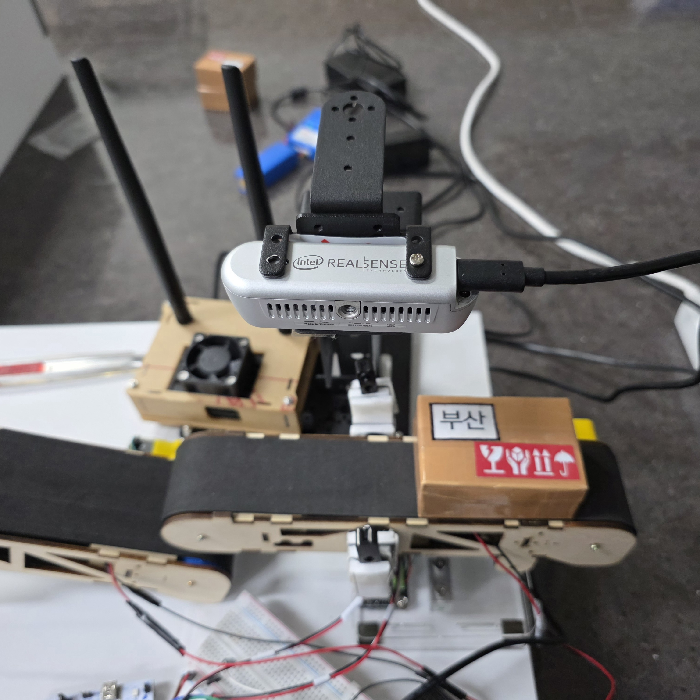
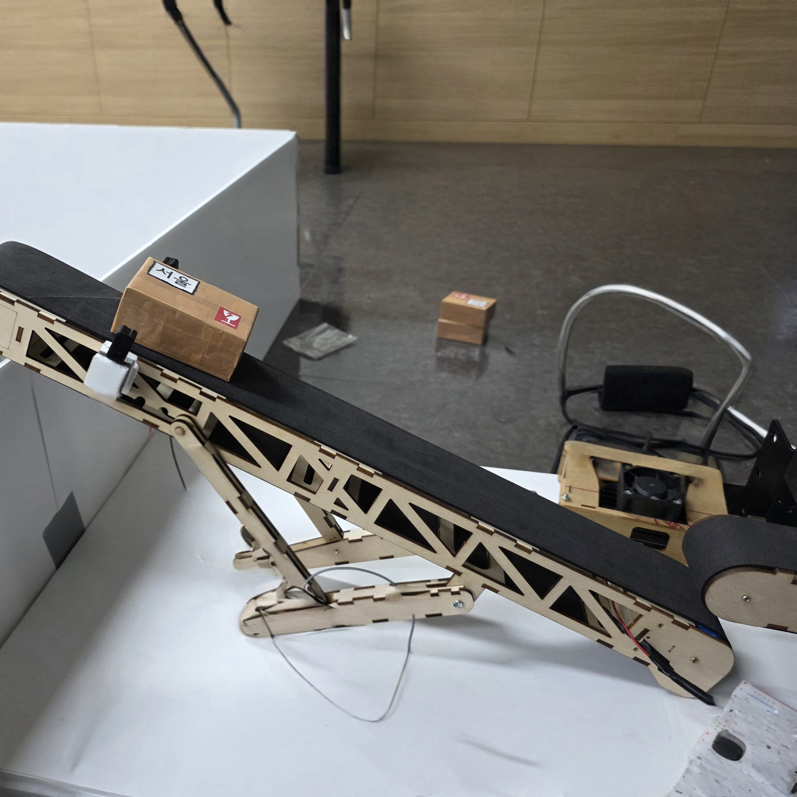
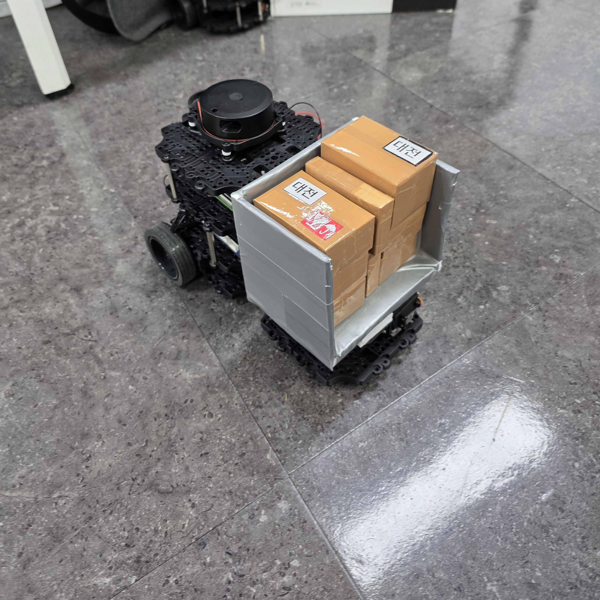

# 프로젝트 개요
> 자율주행 로봇 기반 물류 자동화 시스템 'Box Box'
- 비전 AI : 송장을 검출하여 배송 지역을 자동 분류, 취급주의 라벨을 인식하여 DB에 기록
- 컨베이어 벨트 : 택배의 정보를 바탕으로 지역별로 분류, 미분류 택배는 열외
- ROS2 기반 자율주행 운반 로봇 : 지역 분류 결과 수신 시 경로 계획 및 자율주행

|  |  | 
| -------------------------------- | -------------------------------- |-------------------------|


> [참고자료](https://drive.google.com/drive/folders/1opxbbcvEv3vFWWQGO4Jfo-r_QzLI37Ur?usp=drive_link)
## 팀원
- 정태윤 : ROS2 자율주행 운반 로봇 개발
- 김민수 : STM32 컨베이어벨트 시스템 개발
- 조성범 : 온디바이스 AI 개발, GUI 관제 시스템 개발

```
./
├─ Qt_GUI/BoxBoxApplication/     # Qt6 + rclcpp GUI 앱
├─ docs/                         # 통신 규약 등 문서
├─ firmware/stm32/               # STM32F411 펌웨어
├─ jetson_AI/                    # ONNX 추론 + OCR + TCP 송신
├─ openCR/                       # OpenCR 펌웨어
├─ ros_tcp_server/               # TCP↔ROS2 통신
└─ turtlebot3_ws/                # ROS2 워크스페이스
```

---

## 하드웨어

* TurtleBot3 Burger
* STM32F411RE + HX711(로드셀) + 브레이크빔 센서 + ESP
* Jetson Nano보드(ONNXRuntime, Tesseract)

---

## 소프트웨어

1. **Jetson AI (`jetson_AI/boxbox_opencv_ai.py`)**

   * ONNXRuntime로 YOLOv8 추론, Tesseract OCR. Levenshtein 후처리.
   * TCP 서버에 `det` 메시지 전송. 기본 HOST=`"192.168.0.2"`, PORT=`9190`.
   * OCR → 코드 매핑: `{서울→"1", 대전→"2", 부산→"3"}`.
   * 취급주의 라벨 검출 → `{fragile:a, care:b, water:c, upside:d}`.

2. **TCP↔ROS2 (`ros_tcp_server/`)**

   * 패키지: `iot_bridge_interfaces`(msg), `tcp_iot_bridge`(C++ 노드).
   * 메시지 타입: `IotMessage.msg` → `sender_id`, `destination_id`, `message`.
   * 노드 파라미터: `port` 기본 9190.
   * 실행 예: `ros2 run tcp_iot_bridge tcp_bridge_node --ros-args -p port:=9190`.

3. **ROS2 패키지군 (`turtlebot3_ws/src/`)**

   * `turtlebot3_aruco` : 카메라 토픽에서 아루코 감지 및 포즈 산출.
   * `turtlebot3_unload` : 목적지 수신(Int32) → Nav2 액션 `NavigateToPose` 수행. 설정: `config/destinations.yaml`(키 "1","2","3").
   * `turtlebot3_dumpbox` : 서보 제어(`servo_controller_node.cpp`), 미션 노드(`mission_executor_node.cpp`), 하트비트.
   * `turtlebot3_emergency` : 비상 정지 브리지(`/emergency_stop` 구독 → `/motor_power` SetBool 호출).

4. **Qt6 GUI (`Qt_GUI/BoxBoxApplication/`)**

   * Qt6 Widgets/Network/Sql + `rclcpp` 연동. `main.cpp`에서 ROS 2 Domain ID=6 고정.

5. **STM32 펌웨어 (`firmware/stm32/final_project_fw/`)**

   * HAL 기반. 모듈: `hx711_dfrobot.c`, `loadcell.c`, `beam.c`, `esp.c` 등.
   * `esp.c`는 수신 라인 버퍼와 메시지 파싱 제공(콜백 버퍼에서 CR/LF 기준 추출).


---

## 통신 프로토콜 (`docs/protocol.md`)

형식: `SRC|WHAT|VAL|EXTRA`

* `SRC` : 발신자(QT, JETSON, STM32, ROS 등)
* `WHAT`: 명령/이벤트 명칭
* `VAL` : 주 데이터(숫자/문자열)
* `EXTRA`: 선택 메타정보(`k=v` CSV)

예시 발신 방향

* STM32 → JETSON: 브레이크빔 트리거 시 `jetson|capture|t`
* JETSON → QT: `jetson|det|<ocr_code>,<det_flags>`

  * `ocr_code` = {"1":서울, "2":대전, "3":부산}
  * `det_flags` = a,b,c,d 조합(`fragile→a`, `care→b`, `water→c`, `upside→d`)

> 참고: 일부 문서에 0/1/2 매핑 서술이 있으나, 실제 Jetson 스크립트와 `destinations.yaml`은 1~3 코드 체계를 사용.

---

## 데이터 흐름

1. 브레이크빔 감지(STM32) → JETSON 캡처 트리거.
2. JETSON: ONNX 추론 + OCR → 목적지 코드(1/2/3)와 라벨 플래그 생성 → TCP로 `det` 송신.
3. TCP 브리지: 수신 문자열을 ROS 2 메시지로 중계.
4. ROS 2:

   * `turtlebot3_unload`가 코드(Int32) 수신 시 미션 시퀀스 시작 → Nav2로 지정 포즈 이동(`destinations.yaml`).
   * `turtlebot3_dumpbox`가 서보/미션 보조 동작 수행.
   * `turtlebot3_emergency`가 `/emergency_stop`→`/motor_power`를 중계.

---

## 빌드 및 실행

### 1) ROS 2 워크스페이스

```bash
# iot 브리지만 부분 빌드 예시
cd ros_tcp_server
colcon build --symlink-install --packages-select tcp_iot_bridge
source install/setup.bash

# 전체 워크스페이스 빌드 예시
dcd ../turtlebot3_ws
rosdep install -y --from-paths src --ignore-src
colcon build --symlink-install
source install/setup.bash
```

### 2) TCP 브리지 노드

```bash
ros2 run tcp_iot_bridge tcp_bridge_node --ros-args -p port:=9190
```

### 3) 미션/통합 런치

```bash
# 목적지 YAML 지정
turtlebot3_unload/config/destinations.yaml

# 통합 실행
ros2 launch <repo>/launch/unload_system.launch.py \
  use_sim_time:=false \
  config_file:=turtlebot3_unload/config/destinations.yaml
```

### 4) Jetson AI 스크립트

```bash
cd jetson_AI
# 필요 패키지: opencv-python, onnxruntime, pytesseract, python-Levenshtein
python boxbox_opencv_ai.py  # HOST, PORT 내부 상수 사용(기본 192.168.0.2:9190)
```

### 5) Qt6 GUI

```bash
cd Qt_GUI/BoxBoxApplication
mkdir -p build && cd build
cmake .. -DCMAKE_BUILD_TYPE=Release
cmake --build . -j
# 실행 시 ROS 2 Domain ID=6
```

### 6) STM32 펌웨어

* CubeIDE 환경에서 `final_project_fw` 빌드.
* 모듈: HX711 드라이버, 로드셀 처리, 브레이크빔, ESP 통신.

---

## 의존성

* ROS 2 Humble, colcon, ament_cmake, Nav2, OpenCV, cv_bridge, tf2, geometry/nav 메시지.
* Jetson: onnxruntime(또는 대응 GPU/TensorRT EP), Tesseract OCR, python‑Levenshtein.
* Qt6(Core/Widgets/Network/Sql).
* STM32Cube HAL.

